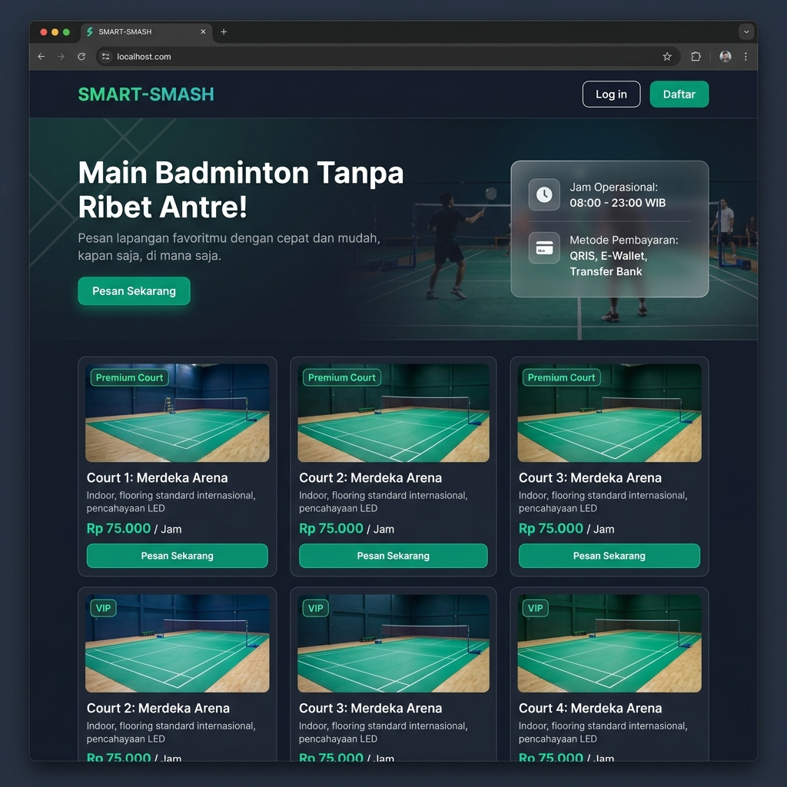
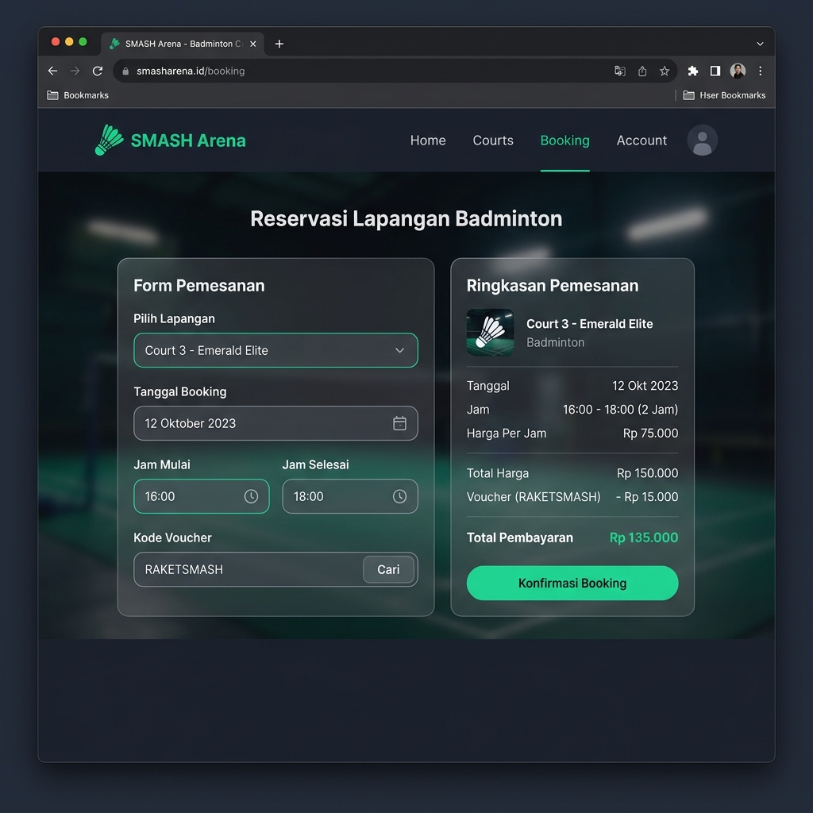
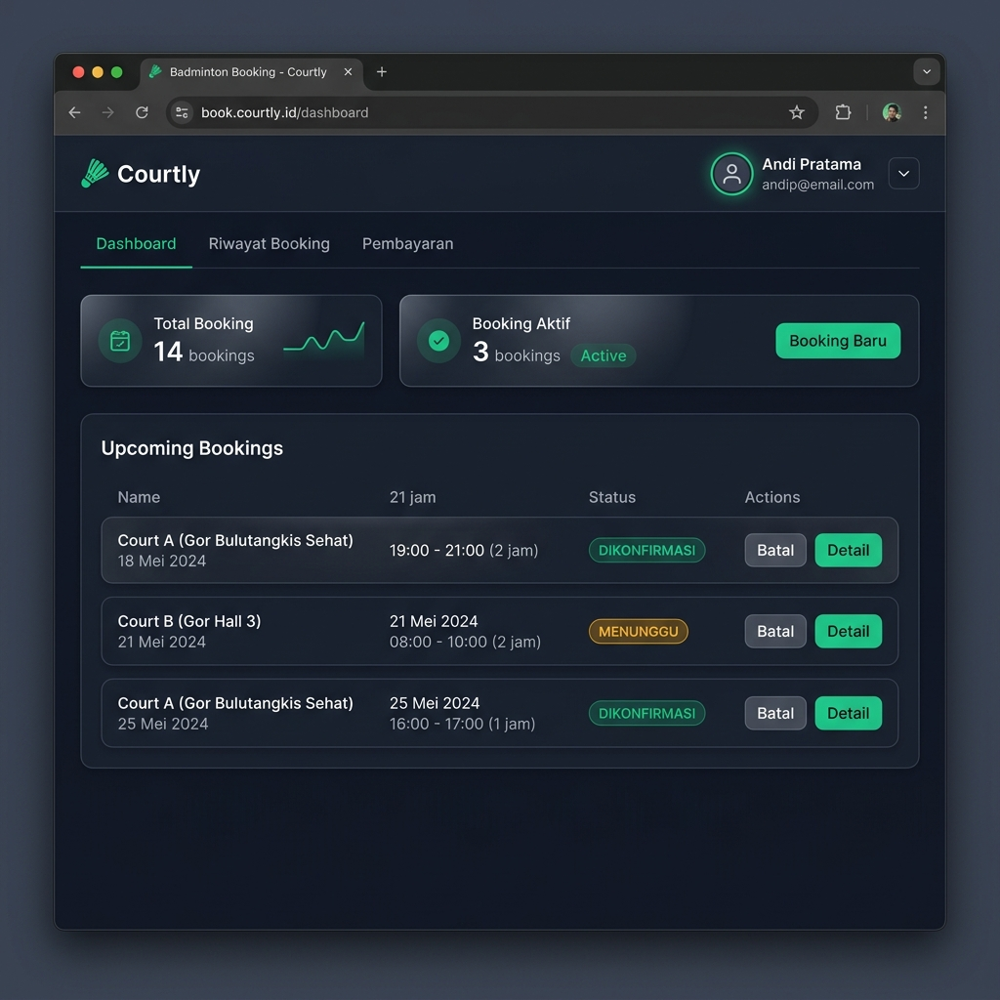
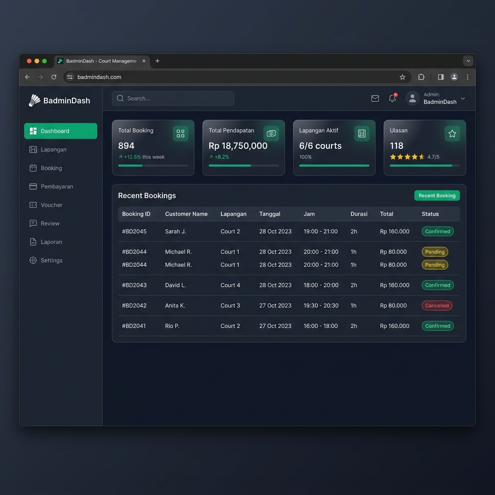

<div align="center">

<h1>🏸 SMART-SMASH</h1>
<p><strong>Sistem Reservasi Lapangan Badminton Online</strong></p>

<p>
  
  
  
  
  
  
</p>

<p><em>Pesan lapangan badminton kapan saja, di mana saja — tanpa perlu antre!</em></p>

</div>

---

## 📸 Screenshots

<table>
  <tr>
    <td align="center"><strong>🏠 Landing Page</strong></td>
    <td align="center"><strong>📅 Form Booking</strong></td>
  </tr>
  <tr>
    <td></td>
    <td></td>
  </tr>
  <tr>
    <td align="center"><strong>👤 Dashboard User</strong></td>
    <td align="center"><strong>🛠️ Dashboard Admin</strong></td>
  </tr>
  <tr>
    <td></td>
    <td></td>
  </tr>
</table>

---

## 📖 Deskripsi

**SMART-SMASH** adalah aplikasi web sistem reservasi lapangan badminton yang dibangun menggunakan **Laravel 12**. Aplikasi ini memungkinkan pengguna untuk melakukan pemesanan lapangan badminton secara online dengan mudah dan cepat — mulai dari memilih lapangan, menentukan jadwal, hingga proses pembayaran digital.

Aplikasi ini dirancang dengan antarmuka modern bertema gelap (*dark mode*) menggunakan **Tailwind CSS**, serta dilengkapi dengan panel admin yang komprehensif untuk pengelolaan seluruh aspek operasional lapangan badminton.

---

## ✨ Fitur Utama

### 👥 Untuk Pengguna (User)
| Fitur | Deskripsi |
|-------|-----------|
| 🔐 **Autentikasi** | Registrasi, login, dan manajemen profil |
| 📋 **Lihat Lapangan** | Melihat daftar lapangan beserta harga dan ketersediaan |
| 📅 **Booking Lapangan** | Pemesanan lapangan dengan pemilihan tanggal dan jam |
| 🎟️ **Voucher Diskon** | Penggunaan kode voucher saat melakukan pemesanan |
| 💳 **Pembayaran Digital** | Upload bukti bayar via QRIS, E-Wallet, atau Transfer Bank |
| 📜 **Riwayat Booking** | Melihat seluruh riwayat pemesanan |
| ⭐ **Ulasan dan Rating** | Memberikan review dan rating setelah bermain |

### 🛠️ Untuk Admin
| Fitur | Deskripsi |
|-------|-----------|
| 📊 **Dashboard Admin** | Statistik total booking, pendapatan, lapangan aktif |
| 🏟️ **Manajemen Lapangan** | CRUD lapangan (nama, jenis, harga, foto, deskripsi) |
| 📋 **Manajemen Booking** | Monitoring dan konfirmasi semua pemesanan |
| 💰 **Manajemen Pembayaran** | Verifikasi bukti pembayaran dari pengguna |
| 🎟️ **Manajemen Voucher** | Membuat dan mengelola kode diskon |
| ⭐ **Manajemen Ulasan** | Moderasi ulasan yang diberikan pengguna |
| 📈 **Laporan** | Ekspor laporan booking dan pendapatan dalam format PDF |

---

## 🛠️ Tech Stack

| Teknologi | Versi | Fungsi |
|-----------|-------|--------|
| **Laravel** | 12.x | Backend Framework |
| **PHP** | 8.2+ | Server-side Language |
| **MySQL** | 8.x | Database |
| **Tailwind CSS** | 3.x | Styling & UI |
| **Vite** | Latest | Asset Bundler |
| **Laravel Breeze** | 2.4 | Autentikasi |
| **DomPDF** | 3.1 | Ekspor PDF |
| **Concurrently** | Latest | Multi-process Dev |

---

## 🗂️ Struktur Database

```
Database: uts_web_badminton
├── users          → Data pengguna & admin
├── fields         → Data lapangan badminton
├── bookings       → Data pemesanan lapangan
├── reservations   → Data konfirmasi reservasi
├── payments       → Data pembayaran
├── vouchers       → Data voucher diskon
└── reviews        → Data ulasan & rating
```

---

## ⚙️ Instalasi & Menjalankan Proyek

### Prasyarat
Pastikan Anda sudah menginstall:
- **PHP** >= 8.2
- **Composer** >= 2.x
- **Node.js** >= 18.x & **NPM**
- **MySQL** (atau MariaDB)
- **Git**

### 1. Clone Repository
```bash
git clone https://github.com/wahyuenesaputro/UTS_Web.git
cd UTS_Web
```

### 2. Install Dependencies
```bash
composer install
npm install
```

### 3. Konfigurasi Environment
```bash
cp .env.example .env
php artisan key:generate
```

Edit file `.env` sesuaikan konfigurasi database:
```env
DB_CONNECTION=mysql
DB_HOST=127.0.0.1
DB_PORT=3306
DB_DATABASE=uts_web_badminton
DB_USERNAME=root
DB_PASSWORD=
```

### 4. Migrasi & Seed Database
```bash
php artisan migrate --seed
```

### 5. Link Storage
```bash
php artisan storage:link
```

### 6. Jalankan Aplikasi
```bash
# Jalankan semua service sekaligus (server, queue, log, vite)
composer run dev
```

Atau jalankan secara terpisah:
```bash
# Terminal 1: Backend
php artisan serve

# Terminal 2: Frontend Assets
npm run dev

# Terminal 3: Queue Worker
php artisan queue:listen
```

Akses aplikasi di: **http://localhost:8000**

---

## 🔐 Akses Default

> Setelah menjalankan seeder, gunakan akun berikut untuk login:

| Role | Email | Password |
|------|-------|----------|
| **Admin** | admin@smart-smash.com | password |
| **User** | user@smart-smash.com | password |

---

## 📁 Struktur Folder Penting

```
UTS-Web/
├── app/
│   ├── Http/
│   │   └── Controllers/        # Controller aplikasi
│   │       ├── BookingController.php
│   │       ├── FieldController.php
│   │       ├── PaymentController.php
│   │       ├── VoucherController.php
│   │       ├── ReviewController.php
│   │       └── ReportController.php
│   └── Models/                 # Model Eloquent
│       ├── User.php
│       ├── Field.php
│       ├── Booking.php
│       ├── Payment.php
│       ├── Voucher.php
│       └── Review.php
├── database/
│   └── migrations/             # Migrasi database
├── resources/
│   └── views/
│       ├── admin/              # Views panel admin
│       ├── user/               # Views panel user
│       └── welcome.blade.php   # Halaman landing page
├── routes/
│   └── web.php                 # Definisi routing
└── docs/
    └── screenshots/            # Screenshot aplikasi
```

---

## 👨‍💻 Developer

<div align="center">
  <table>
    <tr>
      <td align="center">
        <br/>
        <strong>Wahyu Ene Saputro</strong><br/>
        <em>Mahasiswa Teknik Informatika</em><br/><br/>
        <a href="https://github.com/wahyuenesaputro">
          
        </a>
      </td>
    </tr>
  </table>
</div>

---

## 📋 Informasi Tugas

> 📚 **Ujian Tengah Semester (UTS)** — Pemrograman Web

| Keterangan | Detail |
|------------|--------|
| **Mata Kuliah** | Pemrograman Web |
| **Jenis Tugas** | UTS (Ujian Tengah Semester) |
| **Nama Aplikasi** | SMART-SMASH — Sistem Reservasi Lapangan Badminton |
| **Framework** | Laravel 12 + Tailwind CSS |
| **Repository** | [UTS_Web](https://github.com/wahyuenesaputro/UTS_Web) |

---

## 📄 Lisensi

Proyek ini dibuat untuk keperluan akademik. Dibuat dengan ❤️ menggunakan **Laravel** dan **Tailwind CSS**.

---

<div align="center">
  <p>© 2026 SMART-SMASH — Wahyu Ene Saputro. All rights reserved.</p>
  <p>
    <a href="https://github.com/wahyuenesaputro/UTS_Web">⭐ Kasih Bintang di GitHub!</a>
  </p>
</div>